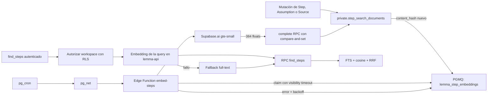

# Recuperación semántica de pasos

Estado: implementado para la demo con `gte-small` y vectores de 384 dimensiones.

## Objetivo

`find_steps` recupera pasos dentro de un único workspace autorizado. La búsqueda es workspace-wide por defecto y permite acotar, de forma opcional, por:

- `objective_id`;
- `strategy_id`;
- `branch_id`;
- `status`.

Los filtros se validan en Postgres para impedir combinaciones que no pertenezcan al workspace. Cuando se filtra por branch se consulta su path efectivo, incluidos los pasos heredados de ramas antecesoras. La búsqueda semántica nunca intenta inferir dependencias, linaje, assumptions ni citas: esas relaciones se siguen consultando en el grafo explícito.

## Decisión de modelo

El runtime usa el modelo integrado de Supabase Edge:

```text
modelo de inferencia: gte-small
identificador persistido: gte-small:384:mean-pool-normalized:v1
dimensiones: 384
pooling: mean
normalización: sí
distancia: coseno
```

El identificador persistido incluye dimensión y configuración. Así una futura migración de modelo no mezcla vectores incompatibles aunque coincida la dimensión.

`gte-small` es apropiado para una demo porque ejecuta la inferencia dentro del Edge Runtime y no necesita una API key externa. Sus límites actuales son importantes: está orientado a inglés y procesa como máximo 512 tokens; el contenido que excede esa ventana se trunca. Las fórmulas y términos matemáticos siguen siendo útiles, pero conviene evaluar ejemplos reales en español antes de mantenerlo como modelo de producción. El ranking full-text siempre permanece activo.

## Arquitectura



Hay dos caminos separados:

1. `embed-steps` indexa documentos de forma asíncrona.
2. `lemma-api` genera el embedding de cada consulta después de autorizar el workspace y llama al mismo RPC que aplica scope, filtros y ranking.

El navegador y WebMCP nunca aceptan ni envían un vector, un nombre de modelo o pesos de ranking.

## Cola, idempotencia y reintentos

La migración habilita `pgmq`, `pg_net` y `pg_cron` sin fijar versiones de extensión. La cola se llama `lemma_step_embeddings`.

Cada mensaje contiene el `step_id`, `workspace_id`, `content_hash` y modelo deseado. El trigger sólo encola cuando se inserta un documento derivado o cambia su hash; escribir el embedding no vuelve a dispararlo.

El worker:

1. reclama un único trabajo por invocación con un visibility timeout;
2. descarta de forma segura mensajes malformados, obsoletos o ya completados;
3. genera y valida exactamente 384 componentes finitos;
4. completa el trabajo sólo si `step_id`, `content_hash` y modelo todavía coinciden;
5. aplica backoff exponencial si falla una inferencia;
6. archiva el mensaje tras el quinto intento fallido.

La comparación por hash evita que un worker lento escriba sobre una revisión posterior. PGMQ permite que un mensaje reaparezca si el worker termina inesperadamente antes de completar o reprogramar el trabajo.

Cada retry deja una fila de diagnóstico, con error saneado y marca terminal, en `private.step_embedding_job_attempts`. Esta tabla no tiene acceso para `anon` ni `authenticated`.

La migración invalida los embeddings anteriores de 1536 dimensiones y encola un backfill de todos los documentos existentes.

## Ranking y respuesta

`find_steps` ejecuta dos rankings acotados dentro del scope autorizado:

- full-text search de Postgres;
- similitud coseno sobre documentos cuyo `embedding_model` coincide exactamente con el modelo de la consulta.

Los rankings se fusionan de forma determinista con reciprocal rank fusion (RRF). La respuesta conserva provenance de workspace, objective, strategy y branch, además del snippet y los ranks individuales.

La API añade:

```json
{
  "retrieval_mode": "hybrid",
  "embedding_model": "gte-small:384:mean-pool-normalized:v1",
  "results": []
}
```

Si la inferencia de la query falla, la petición no pierde la búsqueda léxica:

```json
{
  "retrieval_mode": "lexical_fallback",
  "embedding_model": null,
  "results": []
}
```

## Seguridad

- `lemma-api` conserva el cliente caller-scoped y RLS como frontera de autorización.
- El embedding de la query se calcula sólo después de confirmar acceso al workspace.
- Las RPC de claim, complete y retry son `SECURITY DEFINER`, fijan un `search_path` vacío y sólo conceden `EXECUTE` a `service_role`.
- El cron, programado cada 30 segundos, lee de Vault la URL configurada para el entorno y el token aleatorio del worker.
- `pg_net` envía el token por `x-lemma-embedding-worker-token`; el worker lo reenvía a Postgres y Postgres lo compara con Vault antes de entregar mensajes.
- `embed-steps` usa `verify_jwt = false` únicamente porque aplica esta autenticación de webhook. Una llamada sin token válido no puede reclamar trabajos ni provocar inferencia.
- Los usuarios autenticados ya no pueden actualizar directamente el documento privado ni escribir embeddings arbitrarios.
- Los logs no incluyen el token ni el texto completo indexado.

## Configuración por entorno

La migración crea automáticamente el secreto aleatorio `lemma_embedding_worker_token`. La URL es específica de cada proyecto y debe guardarse una vez bajo el nombre `lemma_project_url`.

Para un entorno nuevo, ejecutar como administrador de base de datos, sustituyendo la URL:

```sql
do $$
declare
  existing_secret_id uuid;
begin
  select id
  into existing_secret_id
  from vault.decrypted_secrets
  where name = 'lemma_project_url';

  if existing_secret_id is null then
    perform vault.create_secret(
      'https://PROJECT_REF.supabase.co',
      'lemma_project_url',
      'Base URL used by pg_net to invoke the embedding worker.'
    );
  else
    perform vault.update_secret(
      existing_secret_id,
      'https://PROJECT_REF.supabase.co',
      'lemma_project_url',
      'Base URL used by pg_net to invoke the embedding worker.'
    );
  end if;
end;
$$;
```

Después se despliegan `embed-steps` y `lemma-api`. Las variables `SUPABASE_URL` y `SUPABASE_SERVICE_ROLE_KEY` las proporciona Supabase a la Edge Function; no se añade ninguna clave al cliente Vite.

## Operación y diagnóstico

Estado de la cola:

```sql
select * from pgmq.metrics('lemma_step_embeddings');
```

Estado de indexación:

```sql
select
  count(*) as documents,
  count(*) filter (where embedding is not null) as embedded,
  count(*) filter (
    where embedding_model = 'gte-small:384:mean-pool-normalized:v1'
  ) as current_model
from private.step_search_documents;
```

Últimos retries, sin exponer el contenido del documento:

```sql
select message_id, attempt, error_message, terminal, created_at
from private.step_embedding_job_attempts
order by created_at desc
limit 20;
```

Invocación manual del mismo camino que usa cron:

```sql
select private.invoke_embedding_worker();
```

El primer diagnóstico ante una cola que no baja debe comprobar, por este orden:

1. que `lemma_project_url` existe en Vault;
2. que `embed-steps` está desplegada;
3. los logs de Edge Functions;
4. los intentos y mensajes archivados de PGMQ;
5. que el documento todavía tiene el mismo `content_hash`.

## Resultado del despliegue de demo

La migración y las dos Edge Functions están desplegadas en el proyecto de demo. La comprobación posterior al despliegue dio este estado:

```text
lemma-api:                 versión 3, ACTIVE
embed-steps:               versión 2, ACTIVE
documentos indexables:     26
embeddings del modelo:     26
mensajes pendientes:       0
retries registrados:       0
fallos terminales:         0
cron:                      activo, cada 30 segundos
```

El backfill inicial se lanzó con lote de ocho y cron cada diez segundos. Tres invocaciones solapadas alcanzaron el límite de recursos de Edge Runtime y respondieron `546`. Los mensajes no se perdieron: al vencer su visibility timeout, PGMQ los volvió a entregar y el backfill terminó con 26/26 documentos. A partir de esa observación se redujo el worker a un trabajo por invocación y el cron a 30 segundos, una configuración más adecuada para el presupuesto de cómputo de esta demo.

La validación funcional tomó el vector ya persistido de un paso como consulta de control. Ese mismo paso obtuvo `semantic_rank = 1`; la búsqueda workspace-wide devolvió resultados de dos objectives y, al aplicar `objective_id`, `strategy_id` y `branch_id`, los siete resultados quedaron dentro del path efectivo solicitado.

El smoke test de la versión final de `embed-steps` respondió `200` con cero trabajos cuando recibió el token de Vault y `401` ante la misma petición sin token.

El typecheck local cubre los handlers testeables; los `index.ts` dependen de globals e imports del runtime Deno. En este cambio se validaron mediante el bundle/despliegue real y los smoke tests. Conviene añadir `deno check` de ambos entrypoints al CI cuando Deno forme parte del entorno de desarrollo.

El asesor de Supabase no detectó errores de seguridad nuevos. Mantiene avisos conocidos: `pg_net` está instalado en `public` y no es relocatable en este proyecto; la tabla privada de intentos tiene RLS sin policies de usuario de forma intencionada porque carece de grants para `anon` y `authenticated`; y la protección de contraseñas filtradas es una configuración global de Auth ajena a este cambio. Los avisos de índices sin uso son esperables con el volumen mínimo de la demo y no justifican eliminarlos todavía.

## Decisiones aplazadas

No se crea HNSW para la demo. Con decenas de pasos, el scan exacto es más simple y evita mantener un índice aproximado que todavía no aporta latencia medible. Cuando el volumen lo justifique, el índice deberá usar `vector_cosine_ops`, igual que el operador `<=>` de la consulta, y se validará con `EXPLAIN (ANALYZE, BUFFERS)` sobre datos representativos.

Un cambio futuro de modelo debe tratarse como una migración: cambiar dimensión si procede, actualizar el identificador activo, invalidar/reencolar todos los documentos y desplegar query y worker de manera coordinada.

## Referencias

- [Automatic embeddings de Supabase](https://supabase.com/docs/guides/ai/automatic-embeddings)
- [Modelos de IA en Edge Functions](https://supabase.com/docs/guides/functions/ai-models)
- [Ejemplo de búsqueda semántica](https://supabase.com/docs/guides/functions/examples/semantic-search)
- [Colas PGMQ](https://supabase.com/docs/guides/queues/pgmq)
- [Programar Edge Functions con pg_cron y pg_net](https://supabase.com/docs/guides/functions/schedule-functions)
- [Modelo Supabase/gte-small](https://huggingface.co/Supabase/gte-small)
